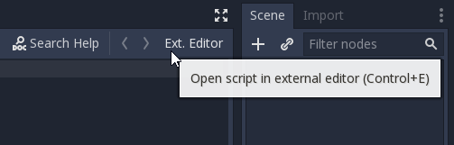

# Raison D'être
Godot's script editor is quite good, but if you're coming from Vim or Emacs, moving around can feel sluggish.
It's already possible to write scripts in an external editor, but there's no way to quickly switch back to the built-in
editor (for, say, debugging) without opening the editor settings and disabling the external editor.

This plugin gives you the best of both worlds by adding a button to the top-right of the built-in script editor that opens the current script in your defined external editor.
When you save the script, Godot will detect the change and automatically reload it.

# Compatibility
This plugin was written and tested in 3.0 stable. I can't guarantee that it will work in 2.1 or any unstable versions.

# Installation
This plugin is available on the Asset Library.

Alternatively, create a folder named `addons` in your project's base folder and clone this repository into it.
The result should look like `.../my-project/addons/open-external-editor/`

# Configuration
In the editor settings (Editor->Editor Settings), find the section for defining an external editor (Text Editor->External).
Make sure `Use External Editor` is **unchecked**, or the plugin won't do anything. `Exec Path` and `Exec Flags` should be set based on what editor you want to use (see below for common examples).

You can optionally change the keyboard shortcut (Ctrl+ E by default) by editing the two constants defined at the top of `open_external_plugin.gd` in the plugin folder. (Eventually I'll come up with an easier way of doing this)

# `Exec Path` and `Exec Flags` examples


### gVim
```
Exec Path:  gvim
Exec Flags: "+normal {line}G{col}|" {file}
```

### Terminal Vim
```
Exec Path: [terminal]
Exec Flags: -e vim "+normal {line}G{col}|" {file}
```

### Emacs
```
Exec Path: emacs
Exec Flags: +{line}:{col} {file}
```

### Sublime Text (Windows)
```
Exec Path: C:\Program Files\Sublime Text 3\sublime_text
Exec Flags: {file}:{line}:{col}
```

# License
MIT

