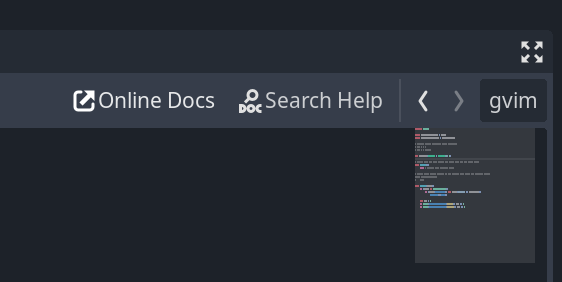

# Open External Editor

## Summary

Godot's script editor is quite good, but if you're coming from Vim or Emacs,
moving around can feel sluggish.

It's already possible to write scripts in an external editor, but there's no way
to quickly switch back to the built-in editor (for, say, debugging) without
opening the editor settings and disabling the external editor.

This plugin gives you the best of both worlds by adding a button to the
top-right of the built-in script editor that opens the current script in your
defined external editor. When you save the script, Godot will detect the change
and automatically reload it.



## Compatibility

- Godot 3 (`gd3`) version tested in:
  - v3.0.6
  - v3.1.2
  - v3.2.3
  - v3.3.4
  - v3.4.5
  - v3.5.2

- Godot 4 (`gd4`) version tested in:
  - v4.0.1

## Installation

### As submodule

If you use `git` as your Version Control System (VCS), you can You can install
this as a submodule of your project as follows.

```bash
# Godot 3
git submodule add -b gd3 \
    https://github.com/krayon/godot-addon-open-external-editor.git \
    addons/open-external-editor
```

This will check out the Godot 3 branch of the addon as a submodule of your
repository, under your project's `addons/` directory.

For Godot 4 it's the same but a different branch:

```bash
# Godot 4
git submodule add -b gd4 \
    https://github.com/krayon/godot-addon-open-external-editor.git \
    addons/open-external-editor
```

If you ever need to clone again you should do so using either:

```bash
# Clone and then initialise and checkout submodules automatically
git clone --recurse-submodules <YOUR_CLONE_ADDRESS_HERE>
```

or after cloning, manually initialise and checkout the submodule:

```bash
# Initialise and checkout submodules
git submodule init
git submodule update
```

### From a downloaded archive

If instead you'd like to download an archive, you can do so from the
[Releases](https://github.com/krayon/godot-addon-open-external-editor/releases)
page. Make sure you select the right version!

Once downloaded, extract it under your project's `addons` directory, creating it
first if needed. eg. In Linux, it would be something like this:

```bash
mkdir -p addons/; cd addons/
tar -zxvf <PATH_TO_DOWNLOADED_ARCHIVE>
```

## Usage

1. Install this in your project's `addons` directory;
2. Open your "Editor Settings" -> "Text Editor" -> "External" settings dialog;
3. Ensure "Use External Editor" is **unchecked** for this addon to work;
4. Configure your "Exec Path" and "Exec Flags"; then
5. Click the button or press the keybinding to launch the external editor.

## Configuration

### Keybinding/Shortcut

By default, the shortcut is set to `Ctrl+E` but this can be changed at the top
of the `open_external_editor.gd` script.

### Exec Flags

Within "Exec Flags", the following strings will be replaced:

  - `{file}`
    - The filename of the current file
  - `{line}`
    - The line the cursor is currently on
  - `{col}`
    - The column the cursor is currently on

#### Examples - gVim

```
Exec Path:  gvim
Exec Flags: "+call cursor({line}, {col})" {file}
```

#### Examples - Terminal Vim

```
Exec Path: [terminal]
Exec Flags: -e vim "+call cursor ({line}, {col})" {file}
```

#### Examples - Emacs

```
Exec Path: emacs
Exec Flags: +{line}:{col} {file}
```

#### Examples - Sublime Text (Windows)

```
Exec Path: C:\Program Files\Sublime Text 3\sublime_text
Exec Flags: {file}:{line}:{col}
```

## History

This addon was originally by _calviken_ however the repository (and their GitHub
account) is now gone.

## License

MIT - see [LICENSE](LICENSE) file.

## Roadmap

- [x] Add to v3 Asset Library - (pending) [Godot Asset Library entry](https://godotengine.org/asset-library/asset/7523)
- [x] Add Godot 4 Support
- Add to v4 Asset Library
- Add keybinding to editor (if possible) or project settings

----
[//]: # ( vim: set ts=4 sw=4 et cindent tw=80 ai si syn=markdown ft=markdown: )
